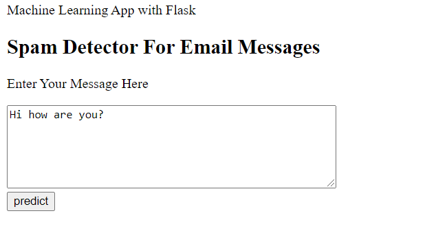

<h4> Email Spam Detection has been a very common and popular subject of interest in Classification problems. Basically we need to predict whether or not a certain email is Spam or Not Spam(or Ham) based on the textual data that is contained in the mail.</h4>

<h4> In this project, I used MultiNomial Naive Bayes algorithm for this particular classification task.One of the reason for me to use this algorithm was that I got an accuracy of about 98%. </h4>

<h4> Website Url: https://spam-detector-email.herokuapp.com/
